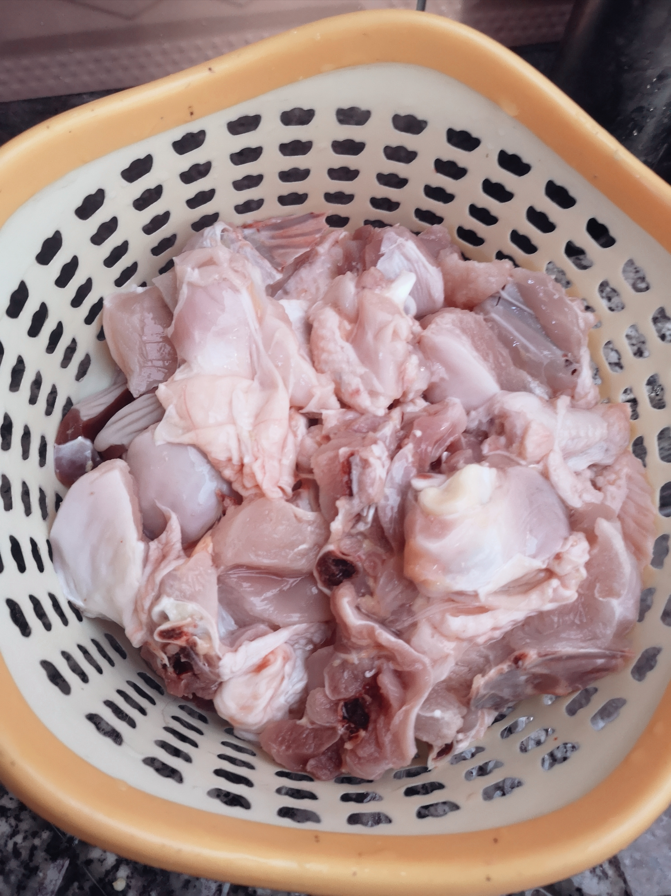
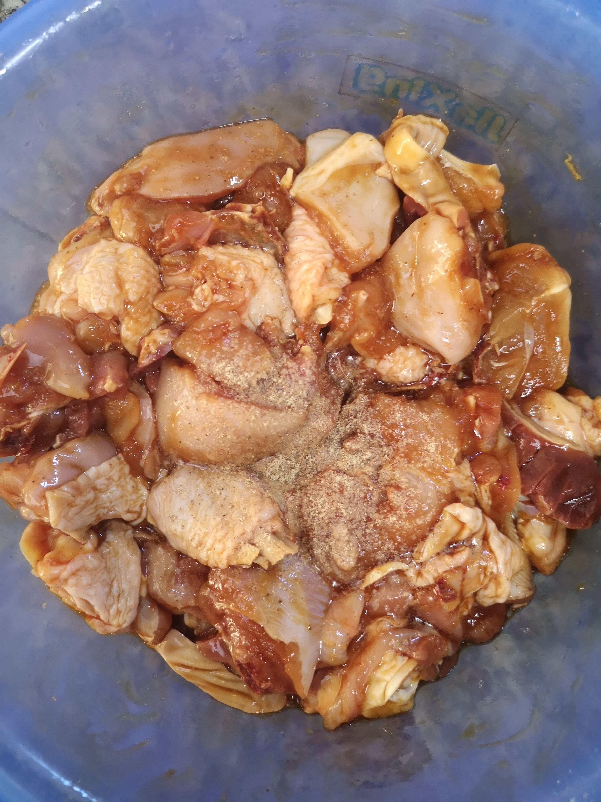
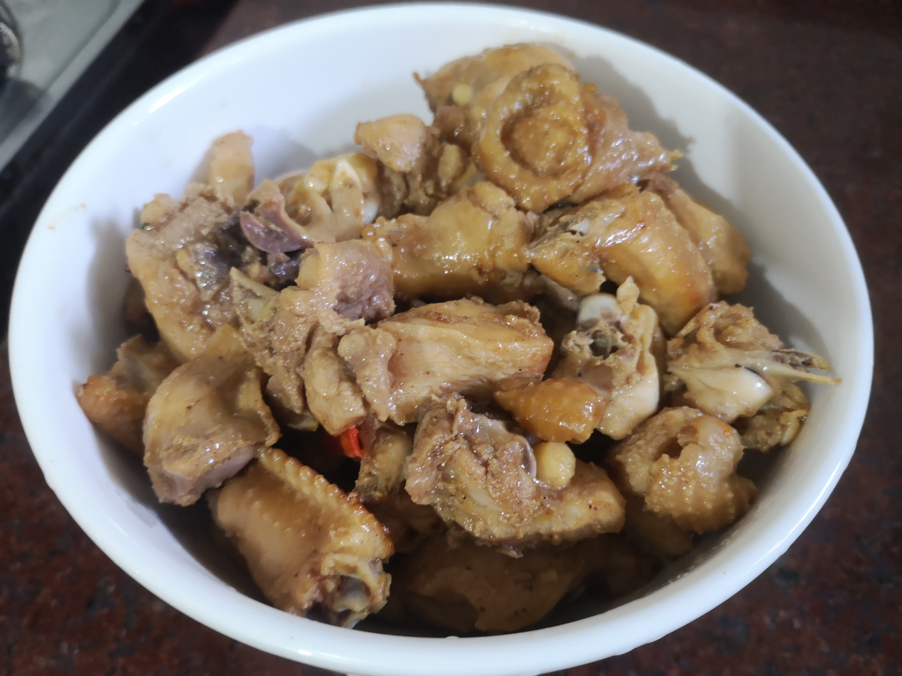
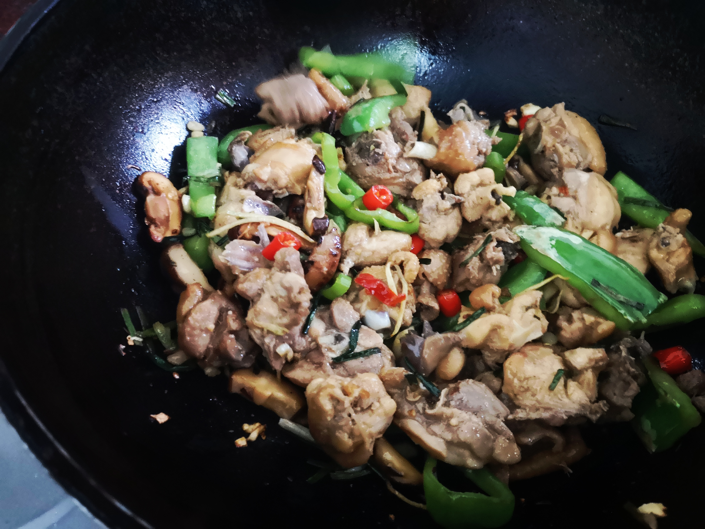
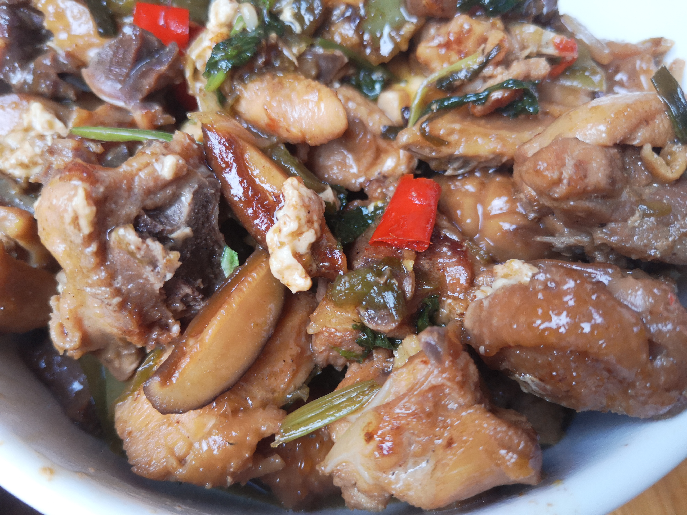
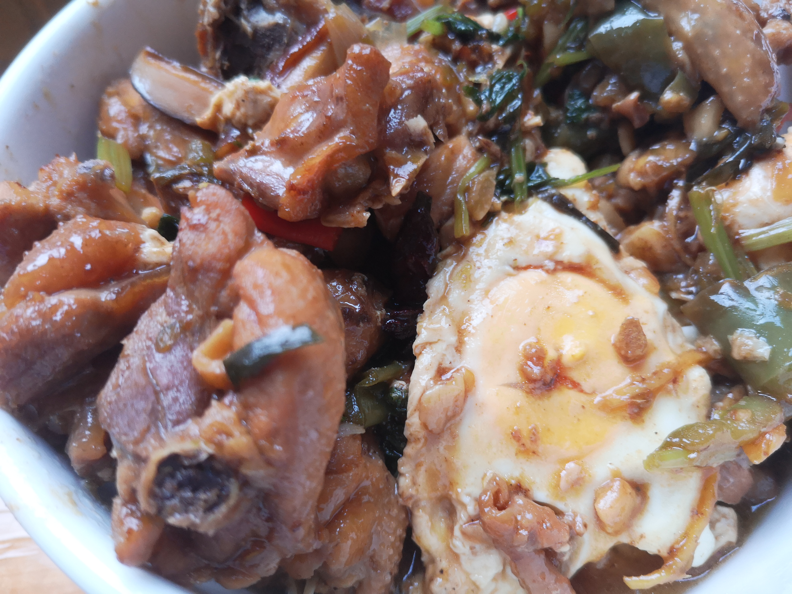

### 食材准备

- 鸡肉：看食量，一般的话半只就够了

- 腌鸡肉的配料：生抽，蚝油，胡椒粉，盐

- 炒鸡肉的配料：洋葱，芹菜，红辣椒，生姜，蒜头，葱，八角，陈皮，香菜

- 啤酒：200 ~ 300 mL

### 制作过程

#### 腌鸡肉

- 将鸡洗净，切块，可以稍微用开水冲一下
  

- 倒入适量我们准备的腌鸡肉的配料：生抽，蚝油，胡椒粉，盐，然后腌制大概二十到三十分钟

#### 煮鸡肉

- 先倒油炒制鸡肉，去除鸡肉的水分，后将鸡肉装盘

- 热油，加入红辣椒，蒜头，八角，煎出香气

- 倒入炒过一下的鸡肉，然后crazy翻动

- 最后加啤酒煮到能吃:)

- 加what ever you want

